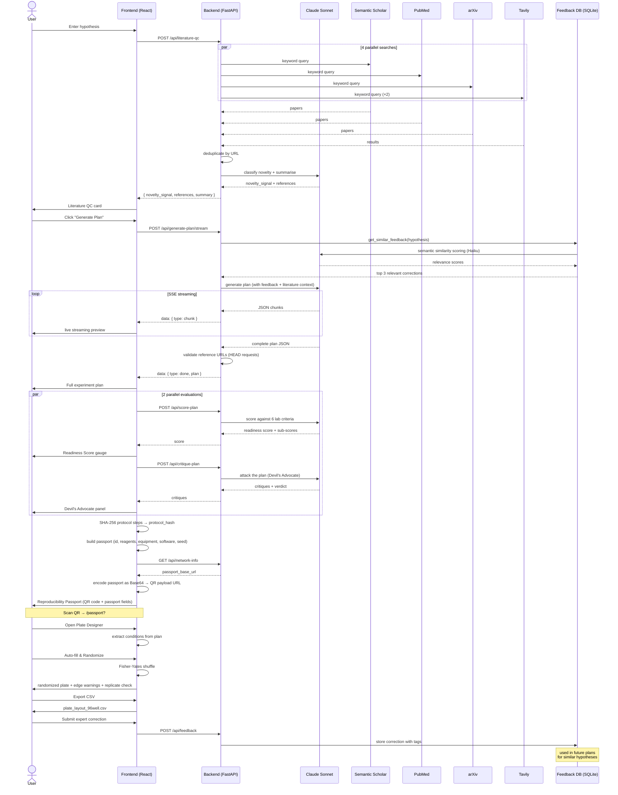

```mermaid
sequenceDiagram
    actor User
    participant FE as Frontend (React)
    participant BE as Backend (FastAPI)
    participant Claude as Claude Sonnet
    participant SS as Semantic Scholar
    participant PubMed
    participant arXiv
    participant Tavily
    participant DB as Feedback DB (SQLite)

    User->>FE: Enter hypothesis
    FE->>BE: POST /api/literature-qc

    par 4 parallel searches
        BE->>SS: keyword query
        BE->>PubMed: keyword query
        BE->>arXiv: keyword query
        BE->>Tavily: keyword query (×2)
    end

    SS-->>BE: papers
    PubMed-->>BE: papers
    arXiv-->>BE: papers
    Tavily-->>BE: results

    BE->>BE: deduplicate by URL
    BE->>Claude: classify novelty + summarise
    Claude-->>BE: novelty_signal + references
    BE-->>FE: { novelty_signal, references, summary }
    FE->>User: Literature QC card

    User->>FE: Click "Generate Plan"
    FE->>BE: POST /api/generate-plan/stream

    BE->>DB: get_similar_feedback(hypothesis)
    DB->>Claude: semantic similarity scoring (Haiku)
    Claude-->>DB: relevance scores
    DB-->>BE: top 3 relevant corrections

    BE->>Claude: generate plan (with feedback + literature context)
    
    loop SSE streaming
        Claude-->>BE: JSON chunks
        BE-->>FE: data: { type: chunk }
        FE->>User: live streaming preview
    end

    Claude-->>BE: complete plan JSON
    BE->>BE: validate reference URLs (HEAD requests)
    BE-->>FE: data: { type: done, plan }
    FE->>User: Full experiment plan

    par 2 parallel evaluations
        FE->>BE: POST /api/score-plan
        BE->>Claude: score against 6 lab criteria
        Claude-->>BE: readiness score + sub-scores
        BE-->>FE: score
        FE->>User: Readiness Score gauge

        FE->>BE: POST /api/critique-plan
        BE->>Claude: attack the plan (Devil's Advocate)
        Claude-->>BE: critiques + verdict
        BE-->>FE: critiques
        FE->>User: Devil's Advocate panel
    end

    FE->>FE: SHA-256 protocol steps → protocol_hash
    FE->>FE: build passport (id, reagents, equipment, software, seed)
    FE->>BE: GET /api/network-info
    BE-->>FE: passport_base_url
    FE->>FE: encode passport as Base64 → QR payload URL
    FE->>User: Reproducibility Passport (QR code + passport fields)
    Note over FE,User: Scan QR → /passport?# → decoded reagents,<br/>protocol hash & random seed on any device

    User->>FE: Open Plate Designer
    FE->>FE: extract conditions from plan
    User->>FE: Auto-fill & Randomize
    FE->>FE: Fisher-Yates shuffle
    FE->>User: randomized plate + edge warnings + replicate check

    User->>FE: Export CSV
    FE->>User: plate_layout_96well.csv

    User->>FE: Submit expert correction
    FE->>BE: POST /api/feedback
    BE->>DB: store correction with tags
    Note over DB: used in future plans<br/>for similar hypotheses
```
